# Financial Statement Analysis Pipeline

A Python-based pipeline that extracts and structures data from financial statements (credit card and bank account statements) using AI-powered document processing.

## Pipeline Architecture

```mermaid
graph LR
    A[PDF Files<br/>📄 Credit Card Statements<br/>📄 Bank Statements] --> B{PDF Extractor}
    B --> C[LlamaParse<br/>🔧 Advanced Layout]
    B --> D[PyPDF<br/>🔧 Fallback Parser]
    C --> E[Raw Text<br/>📝 Extracted Content]
    D --> E
    E --> F[LangChain Processor<br/>🤖 GPT-4 Analysis]
    F --> G[Pydantic Models<br/>✅ Data Validation]
    G --> H[Structured JSON<br/>📊 Final Output]
    
    style A fill:#f0f0f0,stroke:#333,stroke-width:2px,color:#000
    style B fill:#e0e0e0,stroke:#333,stroke-width:2px,color:#000
    style C fill:#d0d0d0,stroke:#333,stroke-width:2px,color:#000
    style D fill:#d0d0d0,stroke:#333,stroke-width:2px,color:#000
    style E fill:#c0c0c0,stroke:#333,stroke-width:2px,color:#000
    style F fill:#b0b0b0,stroke:#333,stroke-width:2px,color:#000
    style G fill:#a0a0a0,stroke:#333,stroke-width:2px,color:#000
    style H fill:#909090,stroke:#333,stroke-width:2px,color:#fff
```



**Flow Description:**
1. **Input**: PDF financial statements (credit card or bank account statements)
2. **Extraction**: Dual-path PDF processing with LlamaParse (primary) and PyPDF (fallback)
3. **Processing**: LangChain orchestrates GPT-4 to analyze and structure the raw text
4. **Validation**: Pydantic models ensure data integrity and type safety
5. **Output**: Clean, structured JSON data ready for analysis

## Overview

This project creates an automated pipeline that:
1. **Extracts text** from PDF financial statements using LlamaParse (with PyPDF fallback)
2. **Processes text** with LangChain and OpenAI's GPT-4 model
3. **Structures data** using Pydantic models for validation and type safety
4. **Outputs** structured JSON data for further analysis

## Features

- **Multi-format support**: Credit card statements and chequing account statements
- **AI-powered extraction**: Uses GPT-4 for intelligent data parsing
- **Robust PDF processing**: LlamaParse for complex layouts with PyPDF fallback
- **Type-safe data models**: Pydantic models ensure data integrity
- **Flexible architecture**: Abstract processor pattern for easy extension

## Project Structure

> **🔒 SECURITY NOTE**: The `data/`, `results/`, and `.env` files have been redacted from this repository to protect PII (Personally Identifiable Information) and sensitive API keys. You will need to create these directories and files locally.

```
finnance/poc/
├── structred_data_extraction.ipynb  # Main Jupyter notebook
├── data/                           # Input PDF files (REDACTED - contains PII)
│   ├── Scotia.pdf                  # Sample bank statement
│   ├── Amex.pdf                   # Sample credit card statement
│   └── Statements.pdf             # Sample statement file
├── results/                       # Output directory (REDACTED - contains PII)
│   └── structured_data.json      # Processed results
├── .env                          # Environment variables (REDACTED - contains API keys)
└── README.md                     # This file
```

## Prerequisites

- Python 3.8+
- Virtual environment (recommended)
- OpenAI API key
- LlamaParse API key
## Installation

1. **Clone or navigate to the project directory**:
   ```bash
   cd /Users/aman/Developer/finnance/poc
   ```

2. **Create and activate a virtual environment**:
   ```bash
   python -m venv venv
   source venv/bin/activate  # On macOS/Linux
   # or
   venv\Scripts\activate     # On Windows
   ```

3. **Install required packages**:
   ```bash
   pip install langchain langchain_openai langchain_community pydantic pypdf llama-parse python-dotenv requests jupyter
   ```

## Configuration

1. **Set up environment variables** by creating a `.env` file in the project root:
   ```env
   OPENAI_API_KEY=your_openai_api_key_here
   LLAMA_CLOUD_API_KEY=your_llama_parse_api_key_here
   ```

2. **API Keys**:
   - **OpenAI API Key**: Required for GPT-4 processing. Get it from [OpenAI Platform](https://platform.openai.com/api-keys)
   - **LlamaParse API Key**: Is recommended for better PDF parsing. Get it from [LlamaIndex Cloud](https://cloud.llamaindex.ai/)

## Running the Notebook

1. **Open in VS Code**:
   ```bash
   code structred_data_extraction.ipynb
   ```

2. **Run the notebook**:
   - Run cells sequentially from top to bottom
   - Make sure you have the Python extension installed in VS Code

3. **Customize the input**:
   - Modify the last cell to process your own PDF files:
   ```python
   # Change the file path and statement type as needed
   results = pipeline.run("./data/your_statement.pdf", StatementType.CREDIT_CARD)
   # or
   results = pipeline.run("./data/your_statement.pdf", StatementType.CHEQUING)
   ```

## Usage Examples

### Processing a Credit Card Statement

```python
from enum import Enum

class StatementType(Enum):
    CREDIT_CARD = "credit_card"
    CHEQUING = "chequing"

# Initialize the pipeline
pipeline = FinancialStatementPipeline()

# Process a credit card statement
results = pipeline.run("./data/Amex.pdf", StatementType.CREDIT_CARD)

# Access structured data
if results and results["structured_data"]:
    statement = results["structured_data"]
    print(f"Account: {statement.account_number}")
    print(f"Statement Period: {statement.statement_period}")
    print(f"Number of transactions: {len(statement.transactions)}")
```

### Processing a Bank Account Statement

```python
# Process a chequing account statement
results = pipeline.run("./data/Statements.pdf", StatementType.CHEQUING)

# Access structured data
if results and results["structured_data"]:
    statement = results["structured_data"]
    print(f"Bank: {statement.bank_name}")
    print(f"Opening Balance: ${statement.opening_balance}")
    print(f"Closing Balance: ${statement.closing_balance}")
```

## Data Models

### Credit Card Statement
- Customer information (first name, last name)
- Account details (number, card type, credit limit)
- Statement period and dates
- List of transactions with dates, descriptions, and amounts

### Chequing Account Statement
- Bank information
- Account number
- Opening and closing balances
- Statement period
- List of transactions with dates, descriptions, types, amounts, and running balances

## Output

The pipeline generates:
1. **Console output**: Processing status and debugging information
2. **JSON file**: Structured data saved to `./results/structured_data.json`
3. **Return object**: Structured Pydantic models for programmatic access

## Troubleshooting

### Common Issues

1. **Missing API Keys**:
   ```
   Error: OPENAI_API_KEY not found in environment variables
   ```
   - Solution: Ensure your `.env` file contains valid API keys

2. **LlamaParse Unavailable**:
   ```
   LlamaParse not available: [error message]
   Falling back to PyPDF
   ```
   - This is normal behavior; the system will use PyPDF as fallback

3. **PDF Processing Errors**:
   - Ensure PDF files are not password-protected
   - Check that file paths are correct
   - Verify PDF files are not corrupted

4. **Virtual Environment Issues**:
   ```bash
   # Recreate virtual environment if needed
   rm -rf venv
   python -m venv venv
   source venv/bin/activate
   pip install -r requirements.txt  # if you have one
   ```

## Extending the Pipeline

To add support for new statement types:

1. **Create a new Pydantic model** for your statement structure
2. **Implement a new processor** inheriting from `AbstractProcessor`
3. **Add the new type** to the `StatementType` enum
4. **Update the factory method** in `FinancialStatementPipeline`

## Dependencies

- `langchain` - LLM framework
- `langchain_openai` - OpenAI integration
- `langchain_community` - Community tools
- `pydantic` - Data validation
- `pypdf` - PDF processing fallback
- `llama-parse` - Advanced PDF parsing
- `python-dotenv` - Environment variable management
- `requests` - HTTP requests
- `jupyter` - Notebook environment

## License

This project is for educational and development purposes. Ensure you comply with the terms of service for OpenAI and LlamaParse APIs.

## Contributing

1. Fork the repository
2. Create a feature branch
3. Make your changes
4. Test thoroughly
5. Submit a pull request

## Support

For issues or questions:
1. Check the troubleshooting section above
2. Review the notebook comments and documentation
3. Ensure all dependencies are properly installed
4. Verify API keys are valid and have sufficient credits
